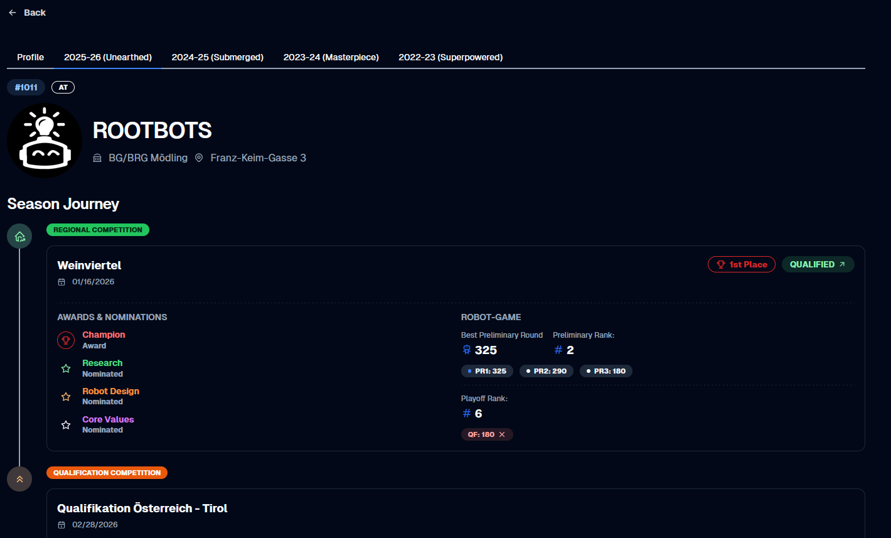

# Challenge Team Hub 🤖🏆

🌍 **Live Platform:** [challengeteamhub.org](https://challengeteamhub.org)



Challenge Team Hub (CT Hub) is a full-stack platform for publishing and exploring FIRST LEGO League competition data. It combines a Spring Boot backend with a React frontend to surface seasons, competitions, team profiles, robot game leaderboards, awards, and search in a single web application.

The backend also includes scraper and synchronization workflows for importing official event data, while the frontend provides a public-facing UI for browsing current and historical results.

## Why It Is Useful

- Tracks FLL seasons, competitions, teams, placements, awards, and robot game results in one place.
- Exposes a public leaderboard and competition detail pages for quick result lookup.
- Supports searchable team and competition discovery from the UI.
- Includes authenticated admin capabilities for login and scraper-triggered synchronization.
- Packages the frontend into the Spring Boot application for a single deployable artifact.

## Architecture

```text
CT Hub
|- src/main/java          Spring Boot API, security, persistence, scraping, scheduling
|- src/main/resources     Application profiles and packaged static assets
|- frontend/              React + TypeScript + Vite application
|- docker-compose.yml     Local PostgreSQL service
|- pom.xml                Maven build that also installs/builds the frontend
```

## Tech Stack

### Backend

- Java 21
- Spring Boot 4.0.1
- Spring Web MVC
- Spring Security with session auth and remember-me cookies
- Spring Data JPA
- PostgreSQL for local and production data
- H2 available as a dependency for lightweight environments
- SpringDoc OpenAPI / Swagger UI
- Jsoup-based scraping services

### Frontend

- React 18
- TypeScript
- Vite
- Mantine UI
- React Router
- Axios
- i18next

## Main Features

- Global robot game leaderboard at `/leaderboard`
- Competition detail pages at `/competition/:seasonId/:urlPart`
- Season-specific team detail pages at `/team/:seasonId/:fllId`
- Public team profile pages at `/:teamProfileUrl` and `/:teamProfileUrl/:seasonId`
- Global search across teams, competitions, profiles, and seasons
- Session-based login flow at `/login`
- Admin-only scraper endpoints for full sync, quick sync, and per-competition refresh

## Getting Started

### Prerequisites

- Java 21
- Maven 3.9+ or the included Maven wrapper
- Node.js 24+ for standalone frontend work
- Docker Desktop or another Docker runtime for local PostgreSQL

### 1. Start PostgreSQL

From the repository root:

```bash
docker-compose up -d
```

This starts PostgreSQL 16 on `localhost:5432` with the default local database:

- Database: `ct_hub`
- User: `dev`
- Password: `dev`

### 2. Run the Backend

Use the local Spring profile so CORS, SQL logging, and seeded admin credentials match local development.

Windows:

```powershell
.\mvnw.cmd spring-boot:run "-Dspring-boot.run.profiles=local"
```

macOS/Linux:

```bash
./mvnw spring-boot:run -Dspring-boot.run.profiles=local
```

The API will be available at `http://localhost:8080`.

On first startup, the app seeds an admin user if the user table is empty:

- Email: `admin@challengeteamhub.org`
- Password in `local` profile: `admin123`

### 3. Run the Frontend

From `frontend/`:

```bash
npm install
npm run dev
```

The Vite dev server runs on `http://localhost:5173` and proxies `/api` requests to `http://localhost:8080`.

### 4. Build the Full Application

The Maven build installs Node, runs the frontend build, and copies the frontend output into the Spring Boot JAR.

Windows:

```powershell
.\mvnw.cmd clean package
```

macOS/Linux:

```bash
./mvnw clean package
```

Run the packaged application:

```bash
java -jar target/backend-0.0.1-SNAPSHOT.jar
```

## Environment and Profiles

The repository uses Spring profiles and environment variables for local and production environments.

### Local profile

Configured in `src/main/resources/application-local.yaml`:

- Allowed frontend origin: `http://localhost:5173`
- Remember-me key: `local-remember-me-key`
- Seed admin password: `admin123`

### Production profile

Configured in `src/main/resources/application-prod.yaml` and `src/main/resources/application.yaml`.

Expected environment variables include:

- `PGHOST`
- `PGPORT`
- `PGDATABASE`
- `PGUSER`
- `PGPASSWORD`
- `REMEMBER_ME_KEY`
- `ADMIN_PASSWORD`

## Common Development Commands

From the repository root:

```bash
docker-compose up -d
./mvnw test
./mvnw clean package
```

On Windows, replace `./mvnw` with `.\\mvnw.cmd`.

From `frontend/`:

```bash
npm install
npm run dev
npm run build
npm run lint
npm run gen:api
```

`npm run gen:api` regenerates the typed client from `http://localhost:8080/v3/api-docs`.

## Usage Notes

- Public pages are available without logging in.
- The frontend checks the current session on startup via `/api/auth/me`.
- Swagger UI is available after the backend starts at `http://localhost:8080/swagger-ui.html`.
- In production, scheduled scraping runs hourly for quick result syncs and nightly for full synchronization.

## Where To Get Help

- Check the OpenAPI UI at `http://localhost:8080/swagger-ui.html` for the current API surface.
- Review [HELP.md](HELP.md) for Spring Boot reference material.
- Use the repository issue tracker in your Git hosting platform for bugs, regressions, and feature requests.

## Maintainer

Developed and maintained by Sebastian Schreitter.